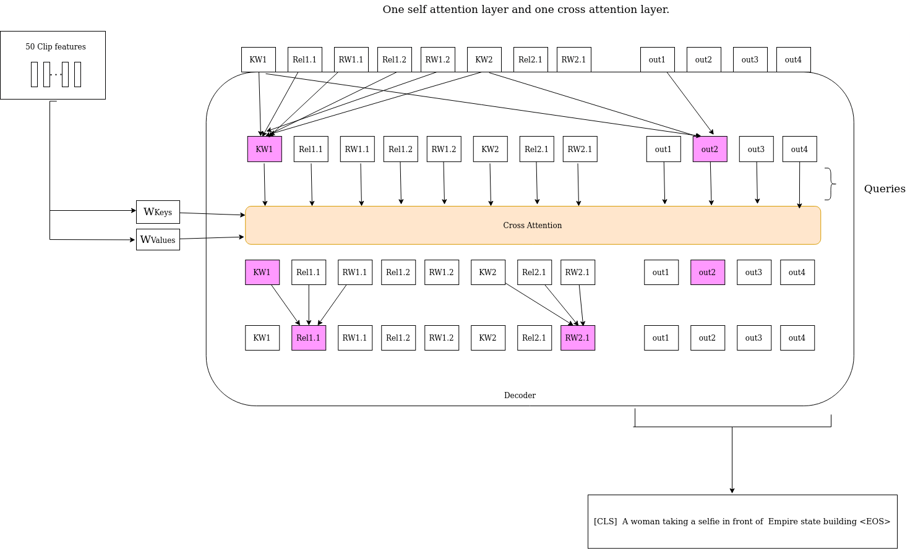

# Knowledge Graph reasoning


<p align="center">
  
</p>

### The text below is still from Meshed memory:
Run `python test.py` using the following arguments:
This repository contains the reference code for the paper _[Meshed-Memory Transformer for Image Captioning](https://arxiv.org/abs/1912.08226)_ (CVPR 2020).

| Argument | Possible values |
|------|------|
| `--batch_size` | Batch size (default: 10) |
| `--workers` | Number of workers (default: 0) |
| `--features_path` | Path to detection features file |
| `--annotation_folder` | Path to folder with COCO annotations |

#### Expected output
Under `output_logs/`, you may also find the expected output of the evaluation code.


## Training procedure
Run `python train.py` using the following arguments:

| Argument | Possible values |
|------|------|
| `--exp_name` | Experiment name|
| `--batch_size` | Batch size (default: 10) |
| `--workers` | Number of workers (default: 0) |
| `--m` | Number of memory vectors (default: 40) |
| `--head` | Number of heads (default: 8) |
| `--warmup` | Warmup value for learning rate scheduling (default: 10000) |
| `--resume_last` | If used, the training will be resumed from the last checkpoint. |
| `--resume_best` | If used, the training will be resumed from the best checkpoint. |
| `--features_path` | Path to detection features file |
| `--annotation_folder` | Path to folder with COCO annotations |
| `--logs_folder` | Path folder for tensorboard logs (default: "tensorboard_logs")|

For example, to train our model with the parameters used in our experiments, use
```
python train.py --exp_name m2_transformer --batch_size 50 --m 40 --head 8 --warmup 10000 --features_path /path/to/features --annotation_folder /path/to/annotations
```

#### References
[1] P. Anderson, X. He, C. Buehler, D. Teney, M. Johnson, S. Gould, and L. Zhang. Bottom-up and top-down attention for image captioning and visual question answering. In _Proceedings of the IEEE Conference on Computer Vision and Pattern Recognition_, 2018.
